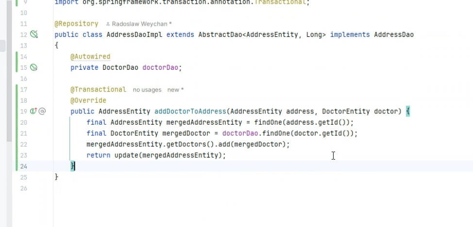

Laboratorium II - Architektura warstwowa, EntityManager oraz testy

Uwaga! Do wykonania zadan konieczne jest zaimplementowanie modelu obiektowo-relacyjnego bazy z Laboratorium I !

1. Korzystajac z przykladowego kodu dla encji AddressEntity utworz warstwy dostepu do danych 
(Repository, Service, mappery, TOsy, opcjonalnie RESTy - dla chetnych) dla encji PatientEntity. 
Spelnione maja byc nasteoujace wymagania:
   - ~~TO pacjenta ma miec liste wizyt ktore sie odbyly~~
   - ~~kazda wizyta ma miec informacje o czasie (daty), imie i nazwisko lekarza oraz liste typow (z encji MedicalTreatment)~~
   -  ~~rozszerz encje PatientEntity o jedno dowolne pole innego typu niz String, odwzoruj je w TO.~~
2. ~~Korzystajac z przykladowych insertow w pliku data.sql uzupelnij encje pacjenta, doktorow oraz wizyt danymi testowymi~~
3. ~~Korzystajac z przykladowych testow dla encji Address, napisz testy do serwisu (uwaga! serwisu, nie DAO!) pacjenta:~~
   - ~~test usuwajacy pacjenta sprawdza czy usuniete zostaly wszystkie wizyty (kaskada) i czy nie zostali usunieci doktorzy~~
   - ~~pobranie pacjenta po ID powinno zwrocic strukture TO-sow odpowiadajaca wczesniejszym zalozeniom. W asercjach sprawdz poprawnosc odczytu dodanego przez Ciebie pola z punktu pierwszego~~
4. Dodaj metode w PatientDao, ktora na podstawie parametrow wejsciowych:

   ID pacjenta, ID doktora, data wizyty, opis wizyty 

   utworzy nowa encje wizyty i doda ja do pacjenta w jednym wywolaniu - kaskadowy update pacjenta (merge). 

   Npisz test do tej metody (Dao)

Notatki do Lab2:
TO - > Transfer obiekt

Przepływ informacji w projekcie:

rest/addresController
metoda GET

Logika biznesowa jest w service/impl/addresserviceimpl jest adnotacja @Transactional! Otwiera dostęp do bazy danych, przetwarzać, usuwać, aktualizować itd.
zamknięcie transakcji wystepuje kiedy jest powrót z funkcji

REST -> SERVICE -> DAO direct access object (interfejs) 

Sprwadzić przy usuwanie czy kaskady działają (testy)
1. DAO zainspirowac sie przykladowym
2. serwisowy PatientTO